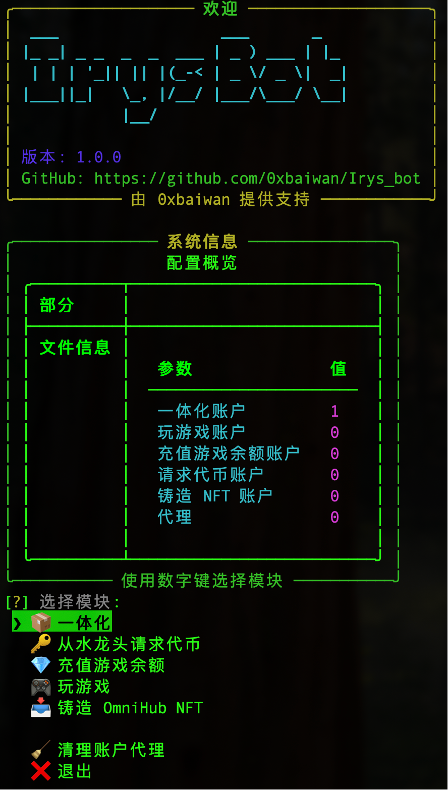

#  Irys 测试网机器人 [v2.0.0]

<div align="center">
  
  
</div>

---

## ✨ 项目简介

**Irys 测试网机器人**是一款自动化工具，专为 Irys 测试网量身打造。它能高效地完成各种测试网任务，比如从水龙头领取测试代币、参与链上游戏、管理游戏余额以及铸造 NFT 等。完全免费开源。

---

## 🙏 致谢与项目来源

本项目基于 **Jaammerr** (GitHub: [https://github.com/Jaammerr](https://github.com/Jaammerr)) 的项目，进行了全面的汉化，并增添了一些实用的小功能优化（例如循环执行任务和在代理不可用时自动切换到本地网络等）。衷心感谢原作者的无私贡献！


---

## 🚀 功能模块

本机器人提供以下核心功能模块，助您在 Irys 测试网上畅行无阻：

*   **一体化 (All in One):** 按照您预设的顺序，自动执行一系列任务，实现全流程自动化。**支持任务随机化。**
*   **从水龙头请求代币:** 自动从 Irys 测试网水龙头领取测试代币，省去手动操作的麻烦。
*   **充值游戏余额:** 自动为游戏账户充值 IRYS 代币，确保游戏顺畅进行。
*   **玩游戏:** 自动化参与 Irys 测试网上的各种游戏，轻松获取奖励或积分。
*   **铸造 OmniHub NFT:** 自动执行铸造 OmniHub NFT 的操作。
*   **清理账户代理:** 方便地管理和清理账户关联的代理设置。

---

## 💻 系统要求

在启动机器人之前，请确保您的系统已准备就绪：

*   **Python 3.11 或更高版本:** 强烈推荐使用最新稳定版 Python，以获得最佳兼容性和性能。
*   **稳定的互联网连接:** 确保机器人能稳定地与 Irys 测试网进行通信。
*   **可用的代理 (HTTP):** 机器人支持通过 HTTP 代理运行，这有助于增强匿名性和操作稳定性。**如果未提供代理，机器人将智能地默认使用您的本地网络连接。**
*   **EVM 钱包:** 用于进行所有链上操作的以太坊虚拟机 (EVM) 兼容钱包。
*   **验证码解决方案余额:** 如果任务需要解决验证码（例如 Cloudflare、Geetest），请确保您已配置支持的验证码服务（如 [Capsolver](https://dashboard.capsolver.com/passport/register?inviteCode=PFxLlbXG2AF8), [2Captcha](https://2captcha.com/), Anti-Captcha, Capsolver, Solvium）并保证账户余额充足。

---


## ⚙️ 安装指南

请按照以下简单步骤安装和设置 Irys 测试网机器人：

1.  **克隆仓库:**
    ```bash
    git clone https://github.com/0xbaiwan/Irys_bot.git
    cd Irys-Testnet-Bot
    ```

2.  **创建并激活虚拟环境 (强烈推荐):**
    ```bash
    python -m venv venv
    # Windows 用户
    .\venv\Scripts\activate
    # macOS/Linux 用户
    source venv/bin/activate
    ```

3.  **安装依赖:**
    ```bash
    pip install -r requirements.txt
    ```

4.  **配置 `settings.yaml`:**
    *   打开 `config/settings.yaml` 文件。
    *   根据您的具体需求，细致配置 `application_settings`、`attempts_and_delay_settings`、`captcha_settings`、`all_in_one_settings`、`games_settings`、`web3_settings` 以及新增的 **`loop_settings`**。
    *   **`all_in_one_settings` 中的 `shuffle_tasks`:** 设置为 `true` 可使一体化模块中的任务顺序随机化。默认为 `false`。
    *   **`web3_settings` 中的余额门槛:**
        *   `verify_balance: true/false`：设置为 `true` 以启用余额验证。
        *   `faucet_balance_threshold: [浮点数]`：领取水龙头前，如果账户余额大于或等于此门槛，则跳过领取。默认 `0.0` 表示只要有余额就跳过。
        *   `top_up_balance_threshold: [浮点数]`：充值游戏余额前，如果游戏余额大于或等于此门槛，则跳过充值。默认 `0.0` 表示只要有余额就跳过。
    *   **重要提示:** 请务必在 `captcha_settings` 中填入您选择的验证码服务 API 密钥。

5.  **准备账户文件:**
    *   在 `config/data/` 目录下，根据您计划执行的模块，编辑相应的 `.txt` 文件（例如 `all_in_one_accounts.txt`, `request_tokens_accounts.txt`）。
    *   **请注意:** 每个文件每行填写一个私钥。
    *   **安全警告:** 您的私钥将以纯文本形式存储在这些文件中。尽管这些是测试网钱包且目前没有实际资金，但为了您的资产安全，**我们强烈建议您不要使用任何包含真实资产的私钥**。在任何生产环境中，私钥绝不应以纯文本形式存储。

6.  **准备代理文件 (可选):**
    *   如果您希望使用代理，请在 `config/data/proxies.txt` 文件中，每行填写一个 HTTP 代理。**如果此文件留空，机器人将自动使用您的本地网络连接。**  
    PS: 可以买 [Haiwaidaili](https://www.haiwaidaili.net/register?Invitation_code=11812) 的动态机房 ip 服务，便宜量大

---

## 🔄 循环执行功能

本机器人现已支持在所有账户任务完成后，自动等待一段时间后再次执行您选定的模块，实现无人值守的自动化。

*   **配置方法:** 在 `config/settings.yaml` 文件的 `loop_settings` 部分进行配置：
    *   `enable_loop: true/false`：设置为 `true` 以启用循环功能。默认值为 `false` (即不循环)。
    *   `loop_interval_seconds: [秒数]`：设置每次循环之间的等待时间，单位为秒。例如，设置为 `3600` 表示等待 1 小时。如果 `enable_loop` 为 `true` 但此值设置为 `0`，则机器人将立即重新执行模块而没有延迟。

*   **使用说明:**
    *   当 `enable_loop` 设置为 `true` 时，机器人会在完成所有账户的当前模块任务后，不再提示您按 Enter 键，而是根据 `loop_interval_seconds` 的设置进行等待，然后自动重新执行上次选择的模块。
    *   如果您希望在循环模式下停止机器人，只需在控制台中使用 `Ctrl+C` 组合键即可。

---

## 🚀 使用方法

1.  **启动机器人:**
    ```bash
    python run.py
    ```

2.  **选择模块:**
    *   机器人启动后，控制台会呈现一个直观的交互式菜单。
    *   使用键盘方向键轻松选择您希望执行的功能模块，然后按 `Enter` 键确认。

3.  **监控和交互:**
    *   机器人将依据您的配置和所选模块，自动开始执行任务。
    *   详细的日志信息将实时显示在控制台中，方便您随时掌握运行状态。
    *   **如果未启用循环模式**，在某些操作完成后，机器人可能会提示您按 `Enter` 键继续，以便您进行下一步操作。

---

## ⚠️ 免责声明

*   本机器人仅供 **Irys 测试网**使用，请勿将其用于主网。
*   请务必不要将任何包含真实资产的私钥用于本机器人，以防范潜在风险。
*   使用本机器人进行自动化操作可能存在多种风险，包括但不限于测试网规则变更、API 限制、账户被封禁等。
*   开发者不对因使用本机器人而造成的任何直接或间接损失承担责任。请您务必自行评估并承担所有风险。
